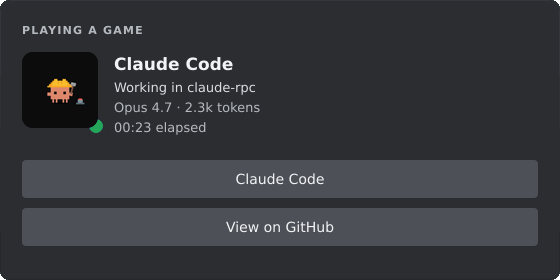
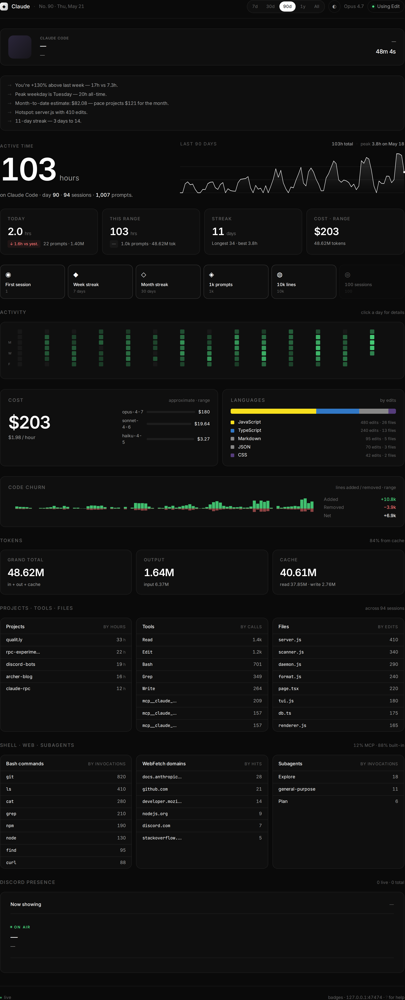
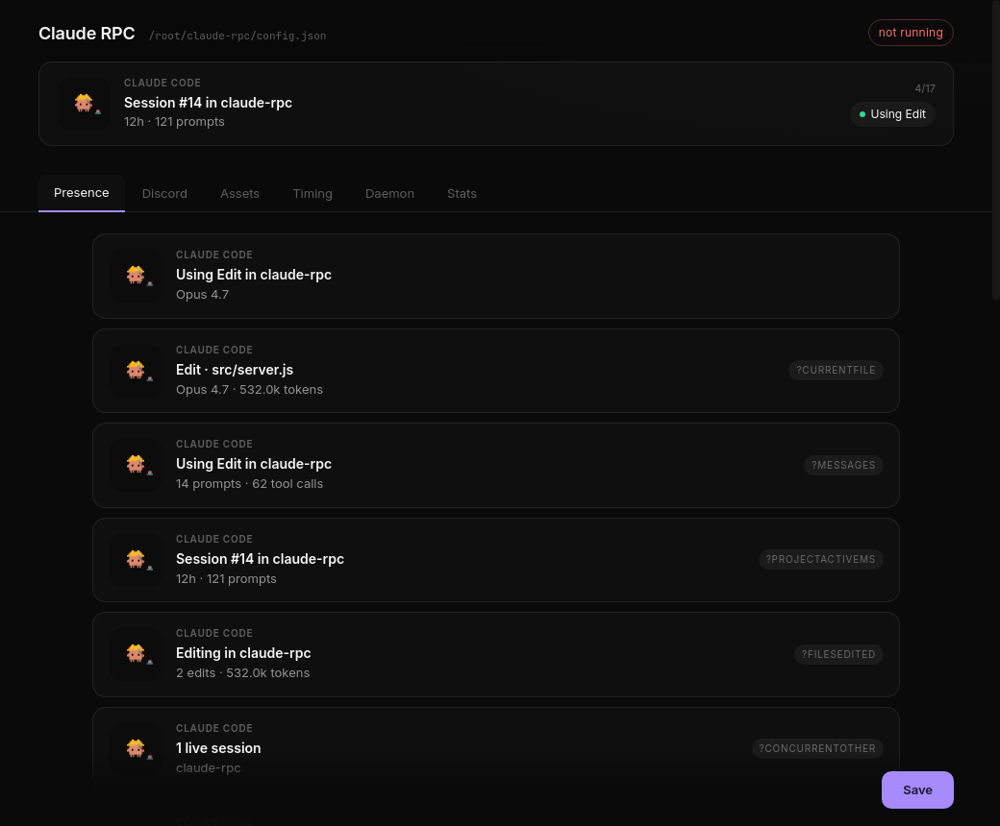

<div align="center">


# claude-rpc

**Discord Rich Presence for [Claude Code](https://claude.com/claude-code).**
Your model, project, current tool, tokens, and lifetime stats — live in your Discord profile. Driven by Claude Code's hooks. Zero polling, zero overhead between sessions.

[](LICENSE)
[](https://nodejs.org)
[](https://claude.com/claude-code)
[](https://discord.com/developers/docs/topics/rpc)

</div>

---

<div align="center">
  
</div>

## Install

**Windows** (no Node required) — [grab the latest portable exe](https://github.com/rar-file/claude-rpc/releases/latest):

```sh
claude-rpc setup
claude-rpc start
```

That's it. Open Claude Code in any project — the daemon picks it up within a second.

The Discord *desktop* app must be running (the browser client doesn't expose the local IPC). Something looks wrong? `claude-rpc doctor`.

<details>
<summary><b>Other platforms / from source</b></summary>

```sh
git clone https://github.com/rar-file/claude-rpc.git
cd claude-rpc
npm install
node ./src/cli.js setup
node ./src/cli.js start
```

Or `npm install -g claude-rpc` for the global bin.
</details>

<details>
<summary><b>Use your own Discord app</b></summary>

A working Discord application is bundled into the default config — you don't need to register your own to get started. To use a different app name on the card, create one in the [Discord Developer Portal](https://discord.com/developers/applications), copy the Application ID, and put it into `clientId` in your config:

```sh
# Linux / macOS
echo '{ "clientId": "YOUR_ID" }' > ~/.config/claude-rpc/config.json
# Windows
echo { "clientId": "YOUR_ID" } > %APPDATA%\claude-rpc\config.json
```

Run `claude-rpc upgrade-config` afterwards if you carry forward a v0.3-era config.
</details>

## Features

**In Discord**

| | |
| :--- | :--- |
| 🔴 **Live status** | Model, project, current tool/file, and token counts update as you work |
| 🎞️ **Status art** | Large image swaps between *working*, *thinking*, *idle*, *stale*, *notification* |
| 🔁 **Rotation frames** | Cycle through today's stats, streak, top file, lifetime totals, anything you template |
| 🐙 **Auto GitHub button** | When your cwd is a git repo with a github origin, a *View on GitHub* button appears |
| 🔒 **Privacy mode** | Per-project `.claude-rpc.json`, runtime `claude-rpc private` toggle, glob-pattern matchers, and auto-detection of GitHub private repos via `gh` |

**Beyond Discord**

| | |
| :--- | :--- |
| 📊 **All-time aggregates** | Hours, prompts, tokens, streaks, hotspots, lines changed, languages, cost, bash usage, web domains, subagent runs — incremental scanner over `~/.claude/projects/*.jsonl` |
| 💰 **Cost estimate** | Per-model spend (Opus/Sonnet/Haiku) using public list prices — editable in `src/pricing.js` |
| 🧠 **Insights** | `claude-rpc insights` generates 3–5 contextual lines: weekly trend, peak weekday, hotspot file, cost pace, streak progress |
| 🖥️ **CLI dashboard** | `claude-rpc status` — heatmap, hour histogram, top tools / files / projects / languages / bash commands / cost |
| 🌐 **Web dashboard** | `claude-rpc serve` — range selector (7d / 30d / 90d / 1y / All), live SSE updates, project drilldown, day-detail modal, theme toggle |
| 🪪 **Badges & cards** | `claude-rpc badge --metric hours --range 7d` (Shields-style SVG) and `claude-rpc card --range year` (poster-style summary) |
| ⚙️ **Config GUI** | Electron app — six tabs: Presence, Discord, Assets, Timing, Daemon, Stats |

## Screens

<table>
<tr>
<td align="center" width="50%"><b>Web dashboard</b><br/><sub><code>claude-rpc serve</code></sub><br/><br/></td>
<td align="center" width="50%"><b>Settings GUI</b><br/><sub><code>npm run dashboard</code></sub><br/><br/></td>
</tr>
</table>

## Commands

| Command          | Description                                              |
| ---------------- | -------------------------------------------------------- |
| `setup`          | Install Claude Code hooks (`~/.claude/settings.json`)    |
| `uninstall`      | Remove Claude Code hooks                                 |
| `upgrade-config` | Re-run idempotent migrations on `config.json`            |
| `start`          | Start the daemon (detached)                              |
| `stop`           | Stop the daemon                                          |
| `restart`        | Stop then start                                          |
| `status`         | Current session + all-time stats (interactive TUI or `--dump`) |
| `today`          | Today's stats + 24h histogram                            |
| `week`           | This week's stats + daily breakdown                      |
| `serve`          | Open the local web dashboard (port 47474)                |
| `preview`        | Show how each rotation frame renders right now           |
| `scan` / `rescan`| Incremental / forced re-parse of `~/.claude/projects`    |
| `backfill <dir>` | Import transcripts from any folder (backup, other machine) |
| `insights`       | Print 3–5 auto-generated insight lines                   |
| `badge`          | Render a Shields-style SVG (`--metric` `--range` `--out`)|
| `card`           | Poster-style SVG summary (`--range year\|month\|week\|all`) |
| `private` / `public` / `privacy` | Per-cwd visibility toggles + status        |
| `doctor`         | Diagnostic checklist — common-failure triage             |
| `tail` / `logs`  | Tail the daemon log                                      |
| `daemon`         | Run the daemon in the foreground (debug)                 |

Exit codes: `0` ok · `1` user error · `2` system error · `3` wrong state. `--version` and `--help` work as expected.

## Config GUI

```sh
cd dashboard
npm install
npm start                # dev mode
npm run dist:mac         # → .dmg
npm run dist:win         # → portable .exe
```

The Electron app reads and writes `config.json` directly. The daemon hot-reloads.

## How it works

Three cooperating pieces, glued by JSON files on disk.

```
   Claude Code                                          Discord desktop
        │                                                     ▲
        │ lifecycle event (stdin JSON)                        │ IPC frame
        ▼                                                     │
   ┌──────────┐    state.json    ┌──────────┐                 │
   │ hook.js  │ ───────────────▶ │ daemon.js│ ────────────────┘
   └──────────┘                  └──────────┘
                                       ▲
                                       │ aggregate.json
                                       │
                                ┌────────────┐
                                │ scanner.js │ ◀── ~/.claude/projects/*.jsonl
                                └────────────┘
```

1. **Hook** (`src/hook.js`) — Claude Code spawns it on every lifecycle event. Parses the JSON event from stdin and mutates the shared state file.
2. **Daemon** (`src/daemon.js`) — Long-running. Connects to Discord's local IPC, watches the state file plus periodic transcript scans, pushes presence frames every few seconds. Exponential backoff with jitter on reconnect.
3. **Scanner** (`src/scanner.js`) — Walks `~/.claude/projects/**/*.jsonl` transcripts for all-time aggregates. Cached at `~/.claude-rpc/aggregate.json` for incremental updates.

Persistent state:

| Path | What |
| ---- | ---- |
| `$TMPDIR/claude-rpc/state.json` | Current session, volatile |
| `~/.claude-rpc/aggregate.json` | All-time aggregates |
| `~/.claude-rpc/scan-cache.json` | Per-transcript scan cache |
| `~/.claude/settings.json` | Hook registrations (managed by `setup`) |

User config lives at `%APPDATA%\claude-rpc\config.json` (Windows), `~/Library/Application Support/claude-rpc/config.json` (macOS), or `$XDG_CONFIG_HOME/claude-rpc/config.json` (Linux). It only needs to hold *overrides* — defaults are baked into the binary.

<details>
<summary><b>Configuration reference</b></summary>

Every key is optional. The shipped defaults work out of the box. Override what you want:

| Key                       | Default | Notes                                                               |
| ------------------------- | ------- | ------------------------------------------------------------------- |
| `clientId`                | bundled | Discord application ID (a working public app ships by default)      |
| `updateIntervalMs`        | `4000`  | How often the daemon pushes to Discord                              |
| `rotationIntervalMs`      | `12000` | How fast rotation frames cycle                                      |
| `rescanIntervalSec`       | `300`   | How often transcripts are re-aggregated                             |
| `idleThresholdSec`        | `60`    | No activity for this long → status `idle`                           |
| `staleSessionMin`         | `5`     | No activity (minutes) → status `stale`; presence cleared            |
| `notificationWindowSec`   | `8`     | How long the `notification` status sticks                           |
| `showElapsed`             | `true`  | Include the elapsed timer                                           |
| `activityType`            | `0`     | `0` Playing, `2` Listening, `3` Watching, `5` Competing             |
| `statusAssets`            | gifs    | Image per status (working / thinking / idle / stale / notification) |
| `presence.byStatus`       | full    | Per-status template block (preferred over `rotation`)               |
| `presence.rotation`       | —       | Legacy: flat array of `{ details, state, requires? }`               |
| `presence.buttons`        | one     | Up to 2 `{ label, url }` buttons                                    |
| `presence.largeImageKey`  | gif     | Fallback large image when no `statusAssets` match                   |
| `presence.largeImageText` | tpl     | Tooltip on hover                                                    |
| `privacy.patterns`        | `[]`    | Glob list of cwd basenames to treat as private                      |
| `privacy.mode`            | hidden  | What `patterns` does — `hidden` / `name-only` / `public`            |

Image precedence: `statusAssets[status]` → `modelAssets[opus|sonnet|haiku]` → `presence.largeImageKey`.

</details>

<details>
<summary><b>Template variables</b></summary>

Both `details` and `state` (and button labels and URLs) support `{name}` substitution.

| Variable                | Sample             |
| ----------------------- | ------------------ |
| `{statusVerbose}`       | `Working`          |
| `{project}`             | `claude-rpc`       |
| `{modelPretty}`         | `Opus 4.7`         |
| `{currentToolPretty}`   | `Edit`             |
| `{currentFilePretty}`   | `src/app/page.tsx` |
| `{tokensFmt}`           | `2.3k`             |
| `{messagesLabel}`       | `8 prompts`        |
| `{todayHours}`          | `56m`              |
| `{weekHours}`           | `3.1h`             |
| `{streakLabel}`         | `7-day streak`     |
| `{allHours}`            | `52h`              |
| `{allTokensFmt}`        | `2.82B`            |
| `{peakHour}`            | `22:00`            |
| `{topEditedFile}`       | `index.html`       |
| `{linesAddedFmt}`       | `24k`              |
| `{topLanguage}`         | `TypeScript`       |
| `{todayCostFmt}`        | `$1.23`            |
| `{allCostFmt}`          | `$89.42`           |
| `{gitBranch}`           | `main`             |

Run `claude-rpc preview` to see every frame rendered with your real data, including which ones would be hidden by their `requires`. Run `claude-rpc vars` for the full machine-readable list.

</details>

## Badges

```sh
claude-rpc badge --metric hours  --range 7d   --out claude-hours.svg
claude-rpc badge --metric streak              --out claude-streak.svg
claude-rpc badge --metric cost   --range 30d  --out claude-cost.svg
claude-rpc badge --metric lines  --range all  --out claude-lines.svg
```

Live via the dashboard too: `http://127.0.0.1:47474/api/badge.svg?metric=hours&range=7d`.

Cost numbers come from `src/pricing.js`, seeded with **approximate** public list prices. Your actual Claude Code subscription bill is unrelated.

## Troubleshooting

**First step is always `claude-rpc doctor`.** It checks Node version, hook registration, daemon liveness, Discord connection, aggregate freshness, and privacy resolution — with a one-line fix hint per failure.

**Discord doesn't pick up presence.** The Discord *desktop* app must be running. The browser client doesn't expose the local IPC. Run `claude-rpc tail` to watch the daemon log live.

**Hooks don't fire.** Run `claude-rpc setup` and check the `hooks` section of `~/.claude/settings.json`. Restart Claude Code so it re-reads hook config. `setup` now test-fires a SessionStart through the same launcher Claude Code will use, so a broken hook command should be caught at install time.

**Config error.** A bad `config.json` won't brick the daemon any more — it logs one line and falls back to baked-in defaults. Check the daemon log via `claude-rpc tail` to see the parse error.

## License

[MIT](LICENSE) © Archer Simmons
